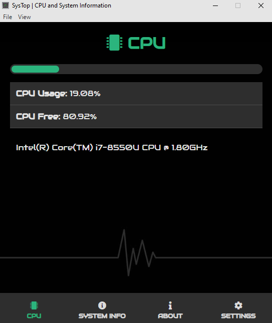
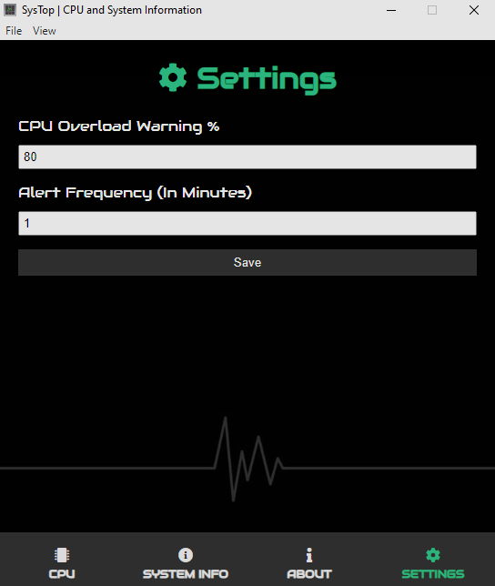
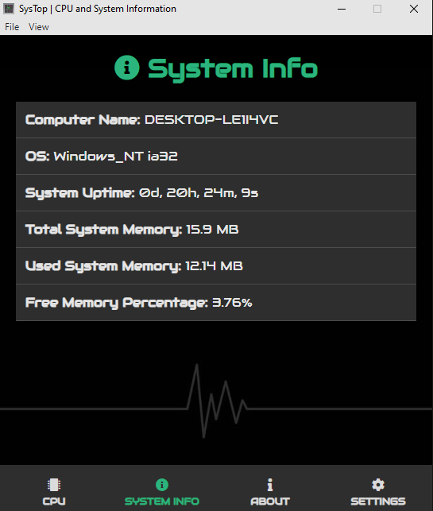
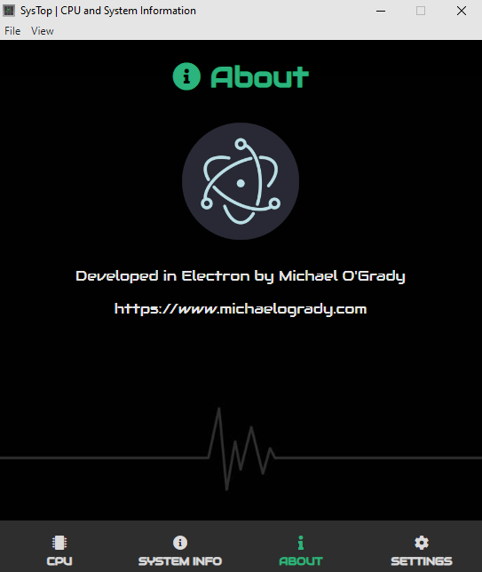

# sys-top-electron-20

SysTop is a executable desktop application developed JavaScript on the Electron platform that allows you to monitor system performance.
[node-os-utils](https://www.npmjs.com/package/node-os-utils/v/1.2.2) is used to get system information.

# Table of Contents

- [sys-top-electron-20](#sys-top-electron-20)
- [Table of Contents](#table-of-contents)
- [Images](#images)
- [Features include](#features-include)
- [Settings storage](#settings-storage)
- [Classes](#classes)
- [Icon Tray](#icon-tray)
- [Useful Documentation](#useful-documentation)
- [node-os-utils](#node-os-utils)
- [devDependencies](#devdependencies)
- [dependencies](#dependencies)
- [Desktop Notifications](#desktop-notifications)
- [Start Application in Development Mode](#start-application-in-development-mode)
- [Build Application](#build-application)

# Images

# Features include

- Tray icon
- Class based JS
  - System information
    - CPU Usage %
    - CPU Free %
    - OS
    - Computer Name
    - System Uptime
    - Total System Memory
    - Used System Memory
    - Free Memory Percentage
  - Ability to set CPU Overload Warning Level
  - Ability to set alert frequency

# Settings storage

Settings are stored in a JSON file persisted to the following local directory:

- `C:\Users\your_name\AppData\Roaming\sys-top-electron-20`
- Data persistance concept from [Cameron Nokes](https://medium.com/cameron-nokes/how-to-store-user-data-in-electron-3ba6bf66bc1e)

# Classes

- AppTray
- MainWindow

# Icon Tray

- Icon must be icon of size 16x16
- `Store.js` manages functionality to store data in a JSON file

# Useful Documentation

> Main Node OS Documentation

- [Node OS](https://nodejs.org/api/os.html)

# node-os-utils

> Actual NPM Libary used to get system info

- [node-os-utils](https://www.npmjs.com/package/node-os-utils/v/1.2.2)

- Monitor vital signs of your server :
  - CPU average usage
  - Free and used drive space
  - Free and used memory space
  - Operating System
  - All processes running
  - TTY/SSH opened
  - Total opened files
  - Network speed (input and output)

# devDependencies

- [x] [electron-packager@14.2.1](https://www.npmjs.com/package/electron-packager/v/14.2.1)
  - `npm i -D electron-packager@14.2.1`
- [x] [Electron](https://www.npmjs.com/package/electron)
  - `npm i -D electron`
- [x] [nodemon](https://www.npmjs.com/package/nodemon)
  - `npm i -D nodemon`
- [x] [electron-packager](https://www.npmjs.com/package/electron-packager/v/14.2.1)
  - `npm i -D electron-packager@14.2.1`

# dependencies

- [x] [electron-log](https://www.npmjs.com/package/electron-log/v/4.1.2)
  - `npm i electron-log@4.1.2`
- [x] [node-os-utils](https://www.npmjs.com/package/node-os-utils/v/1.2.2)
  - `npm i node-os-utils@1.2.2`

# Desktop Notifications

- [Notifications](https://www.electronjs.org/docs/latest/tutorial/notifications)

# Start Application in Development Mode

- Run `npm run dev`
-

# Build Application

- Run `npm run build-package-win`
